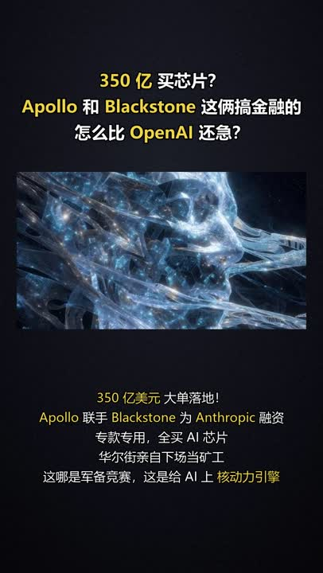
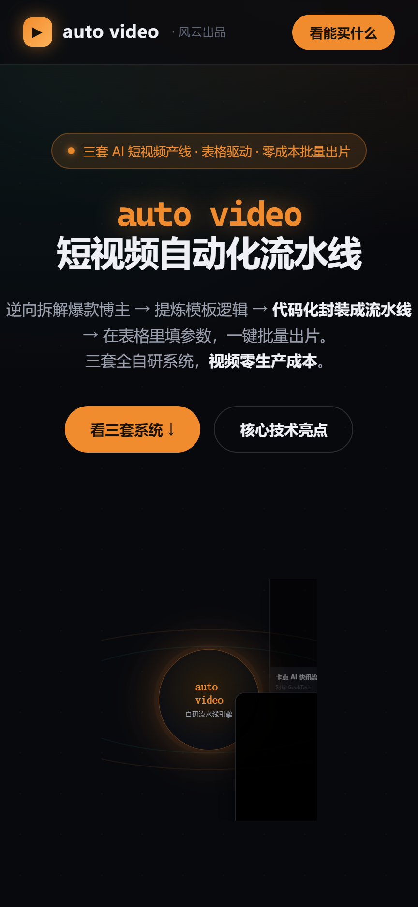

<div align="center">

# AutoVideo · 短视频自动化流水线生成器

**逆向拆解爆款 → 提炼剪辑配方 → 代码化封装成一条能批量出片的专属流水线**

「造工厂的工厂」——输入一类对标爆款，产出一条针对该赛道、表格驱动、零成本批量出片的自动化生产线。

🌐 **完整产品 / 在线案例：[autovideo.fengyunagent.xyz](https://autovideo.fengyunagent.xyz)**

</div>

---

> ## 关于本仓库
>
> 本仓库开源 AutoVideo 的**架构设计、方法论与流水线骨架**，供学习与参考。
> 完整可运行的生产系统——各赛道剪辑配方、文案生成模型、卡点引擎、生产管线——是产品本体，见 👉 **[autovideo.fengyunagent.xyz](https://autovideo.fengyunagent.xyz)**。
>
> **工作方式说明**：AutoVideo 目前是「**人 + AI 协同**」的方式（不是全自动、无人值守）。逆向拆解一个新赛道、搭出一条能跑的流水线，**快的话 3 天以内可以拆解完成**。

---

## 这是什么

大多数「AI 一键生成短视频」工具是**通用生成器**：给个主题，吐个视频，所有赛道一个样。

AutoVideo 不一样。它是一台**造产线的机器**：

```
输入：某一类爆款博主的 3–5 条对标视频 + 一句话说明
  ↓  逆向拆解（视觉 / 节奏 / 文案规律）
  ↓  提炼成「剪辑配方」
  ↓  代码化封装
输出：一条针对该赛道、能批量量产的自动化短视频流水线
       （之后只需在表格里填参数，一键批量出片，零拍摄、零剪辑）
```

收敛判据很硬：**用配方重新生产的样片，要能冒充对标原号的同款**——做不到，就回去改配方。

## 已落地的三条赛道（成果展示）

| 赛道 | 形态 | 对标 |
|---|---|---|
| AI 书单号 | 古典油画 + 双语金句口播 | 情感书单头部号 |
| 对话型知识科普 | 双人对话动画 + AI 克隆配音（横屏） | 「假如书籍会说话」类百万粉号 |
| 卡点 AI 快讯 | 无脸图文 + 真·鼓点卡点 + 自动发布 | 硬核科技快讯号 |

<div align="center">



<br/><sub>三套系统自动产出的真实成片（封面）</sub>
<br/><br/>

<br/><sub>完整产品官网：autovideo.fengyunagent.xyz</sub>
</div>

## 架构概览

三层 + 人工审阅闸门。详见 **[docs/ARCHITECTURE.md](docs/ARCHITECTURE.md)**。

```
A 测量层   逆向提取：镜头/节奏/字幕坐标/配色 + 干净文案（只提取，不评判）
B 推演层   人 + AI 的 harness loop：假设配方 → 出样片 → 比对模板 → 改配方 ↺
           （收敛判据 = 样片 ≈ 对标模板）
D 脚手架   照锁定的配方，生成一个能跑的 <赛道>-pipeline 项目
闸门       关1 机械数字对照 + 关2 真人「像不像」裁决（飞书表驱动）
```

## 仓库结构

```
AutoVideo/
├── README.md                 你正在看的
├── SKILL.md                  编排器说明
├── docs/ARCHITECTURE.md      三层架构 + 方法论
├── schemas/                  配方 / 测量的结构模板
│   ├── recipe.template.yaml
│   └── measurements.schema.json
└── scripts/                  分层骨架（接口 + 说明）
    ├── fetch.py              获取层
    ├── measure.py            测量层
    ├── recipe_executor.py    配方执行器
    └── score.py              评分闸门
```

## 设计原则

- **内容是最高权重**：content-driven 视频里，选题 + 文案是决定爆不爆的魂，不是工艺平级项。
- **数据先行**：任何「N 种模式/结构」的归纳，先跨多条同号视频验证一致，再写进配方。
- **可行性闸门**：推演阶段就回答「素材够不够」——能生成/抓取的赛道才可复刻。
- **人审闸门**：机器算数字、真人判味道；两道关都过才算配方对。

---

## 交流群

<div align="center">

<br/><sub>AI 交流群 · 一起聊 AI 短视频自动化（群满或二维码过期，加微信 FengYunAgent 拉你进群）</sub>
</div>

## 关于 / 联系

作者：**风云**　|　完整产品与案例：**[autovideo.fengyunagent.xyz](https://autovideo.fengyunagent.xyz)**　|　微信：**FengYunAgent**

想要完整能跑的系统、想学怎么自己搭一条流水线、或需要定制新赛道——都在官网。

有需求 / 想合作 / 想学课程，也可以填个表让我了解你：**[需求 / 合作收集表](https://ecnzifm6trb8.feishu.cn/share/base/form/shrcnmgX31UJ9LeLji9bTdJw0Df)**
